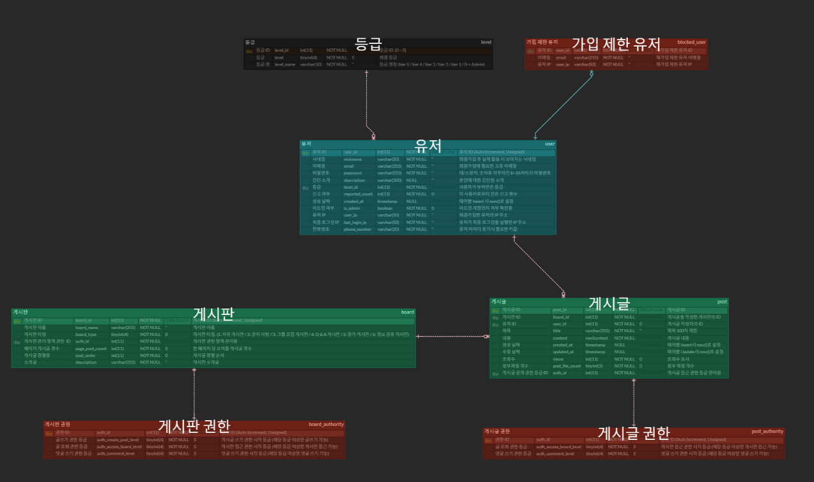

# 스터디 그룹 모집 커뮤니티 서비스

------------
## 1. 목표 및 기능
### 1.1 목표
* 자유롭게 서로 대화할 수 있는 커뮤니티 서비스
* 스터디 그룹 모집의 환경
* 관리자의 회원 관리
### 1.2 기능
#### 게시판
* 게시글 목록 조회 기능 (10 단위로 페이징 적용)
* 각 게시판에 적용된 접근 가능 등급 (회원 등급)에 따른 접근 설정 기능
* 게시글 작성 기능
  * 단, 공지 사항 등의 게시판은 특정 권한을 가진 사람만 가능하도록 설정
* 내가 쓴 게시글만 보기 기능
* 게시글 검색 기능
#### 게시글
* 게시글 제목, 내용, 작성자, 작성일(수정일) 조회
* 자신이 작성한 게시글에 대해 수정 및 삭제 기능 제공
#### 게시글 작성 / 수정
* 글 제목, 글 내용, 글 공개 등급, 댓글 작성 가능 등급 설정
  * 각 폼 내용 별 Required 적용
#### Admin 전용 회원 관리 페이지
* 회원 닉네임 검색 기능
* 회원 목록 정렬 기준 및 정렬 방식 설정
* 회원 등급 조정 기능
* 회원 가입 제한 설정 / 해제 기능

------------
## 2. 개발 환경
### 2.1 개발 환경
* Web Framework
  * Spring Boot 3.2 (Java 17) / Spring Security 6
* ORM
  * JPA, JPQL
* Template Engine
    * Thymeleaf
* DataBase
  * MySQL 8 (Docker)
### 2.2 URL 구조
#### User Authentication
| URL     | Method  | Function | HTML File Name | Description |
|---------|---------|----------|----------------|-------------|
| /login  | GET     | login()  | login.html     | 로그인 페이지     |
| /signup | GET     | signUp() | signup.html    | 회원 가입 페이지   |
#### Post
| URL                   | Method  | Function     | Description     | 필수  |
|-----------------------|---------|--------------|-----------------|-----|
| /api/post/{boardName} | POST    | savePost()   | 해당 게시판에 게시글을 등록 | 로그인 |
| /api/post/{post_id}   | GET     | showPost()   | 게시글 조회          | 로그인 |
| /api/post/{post_id}   | PUT     | updatePost() | 게시글 수정          | 로그인 |
| /api/post/{post_id}   | DELETE  | deletePost() | 게시글 삭제          | 로그인 |
#### Post View
| URL                          | Method | Function                | HTML File Name          | Description                                                                | 필수  |
|------------------------------|--------|-------------------------|-------------------------|----------------------------------------------------------------------------|-----|
| /posts/{boardName}           | GET    | showAllPosts()          | PostList.html           | 게시판의 게시글 목록 페이지 / search로 게시글 검색 / page로 페이징 / orderby,sort로 정렬 기준 및 정렬 순서 | 로그인 |
| /posts/{boardName}/myPost    | GET    | getPostListByUserId()   | PostList.html           | 게시판의 내가 쓴 게시글 목록 페이지 / page로 페이징 / orderby,sort로 정렬 기준 및 정렬 순서             | 로그인 |
| /posts/{boardName}/{post_id} | GET    | showOnePost()           | post.html               | 게시글 상세 페이지                                                                 | 로그인 |
| /posts/{boardName}/newPost   | GET    | createPostByBoardName() | PostCreateOrUpdate.html | 게시글 등록/수정 페이지                                                              | 로그인 |
#### User Management
| URL                        | Method | Function                          | Description  | 필수        |
|----------------------------|--------|-----------------------------------|--------------|-----------|
| /api/admin/user_list       | GET    | getAllUserManagementInfo()        | 회원 목록 조회     | Admin 권한  |
| /api/admin/user/{nickname} | GET    | getUserManagementInfoByNickname() | 특정 회원 닉네임 검색 | Admin 권한  |
| /api/admin/user/level      | PUT    | changeUserLevel()                 | 회원 등급 조정     | Admin 권한  |
| /api/admin/user/blocked    | POST   | setUserToBlockedUser()            | 회원 가입 제한 설정  | Admin 권한  |
| /api/admin/user/unblocked  | DELETE | setBlockUserToUnBlock()           | 회원 가입 제한 해제  | Admin 권한  |
#### User Management View
| URL                           | Method | Function               | HTML File Name          | Description                                          | 필수       |
|-------------------------------|--------|------------------------|-------------------------|------------------------------------------------------|----------|
| /admin/user/management        | GET    | userManagementPage()   | admin-user-manage.html  | 회원 목록 페이지 / page로 페이징 / orderby,sort로 정렬 기준 및 정렬 순서  | Admin 권한 |
| /admin/user/management/search | GET    | searchUserByNickname() | admin-user-manage.html  | 회원 닉네임 검색 결과 페이지                                     | Admin 권한 |

------------
## 3. 요구 사항 명세


------------
## 4. 프로젝트 구조
```html
├─main
│  ├─java
│  │  └─com
│  │      └─springbootcommunitydevproj
│  │          │  SpringbootCommunityDevProjApplication.java
│  │          │  
│  │          ├─config
│  │          │      SecurityConfig.java
│  │          │      SwaggerConfig.java
│  │          │      
│  │          ├─controller
│  │          │      PostController.java
│  │          │      PostViewController.java
│  │          │      UserAuthController.java
│  │          │      UserManagementController.java
│  │          │      UserManagementViewController.java
│  │          │      
│  │          ├─dto
│  │          │      PostListDto.java
│  │          │      PostRequest.java
│  │          │      PostResponse.java
│  │          │      UpdatePostRequest.java
│  │          │      UserManagementInfoDto.java
│  │          │      UserManagementResponse.java
│  │          │      UserRequest.java
│  │          │      
│  │          ├─model
│  │          │      BlockedUser.java
│  │          │      Board.java
│  │          │      BoardAuthority.java
│  │          │      Level.java
│  │          │      Post.java
│  │          │      PostAuthority.java
│  │          │      PostLikes.java
│  │          │      User.java
│  │          │      
│  │          ├─repository
│  │          │      BlockedUserRepository.java
│  │          │      BoardAuthorityRepository.java
│  │          │      BoardRepository.java
│  │          │      PostAuthorityRepository.java
│  │          │      PostLikesRepository.java
│  │          │      PostRepository.java
│  │          │      UserManagementRepository.java
│  │          │      UserRepository.java
│  │          │      
│  │          ├─service
│  │          │      BoardService.java
│  │          │      PostService.java
│  │          │      UserDetailService.java
│  │          │      UserManagementService.java
│  │          │      
│  │          └─utils
│  │                  ResponseMessages.java
│  │                  
│  └─resources
│      │  application.yml
│      │  logback-config.xml
│      │  Ormi-SpringBoot-ERD-Final.sql
│      │  
│      ├─static
│      │      admin-user-management.js
│      │      post.js
│      │      PostCreateOrUpdate.js
│      │      postList.js
│      │      
│      └─templates
│              admin-user-manage.html
│              login.html
│              post.html
│              PostBoard.html
│              PostCreateOrUpdate.html
│              PostList.html
│              signup.html
│
└─test
    └─java
        └─com
           ├─springbootcommunitydevproj
           │    SpringbootCommunityDevProjApplicationTests.java
           │
           ├─post
           │    PostControllerTest.java
           │    PostServiceTest.java
           │
           └─usermanagement
                UserManagementControllerTest.java
                UserManagementServiceTest.java
```

------------
## 5. 역할 분담
* 팀장, 게시판 CRUD 기능 개발 / 회원 관리 Admin 페이지 개발 : 정진환
* 게시판 CRUD 기능 개발 : 정민석
* 로그인, 회원 가입, 댓글 기능 개발 : 신진우

------------
## 6. 데이터 베이스 모델링 (ERD)


------------
## 7. 기능
### 게시판
<br>
_(자유 게시판 화면)_
* 특정 사용자가 접속하면 제일 먼저 로그인 화면으로 이동해 로그인을 진행하도록 합니다.
  * 만약 사용자가 처음 방문했다면 회원 가입을 진행하도록 합니다.


* 기본 화면은 자유 게시판으로 보여줍니다.
  * 자유 게시판은 모든 등급의 회원들이 접근 가능하며 글 쓰기가 가능합니다.

 <br>
_(공지 사항 화면)_ <br>
<br>
_(공지 사항 화면 (Admin))_
* 공지 사항 역시 모든 등급의 회원들이 접근 가능합니다.
  * 하지만 공지 사항의 글 쓰기 권한은 Admin에게만 있습니다.


* 각 게시판은 화면의 위젯으로 이동이 가능합니다.


* 그룹 모집 게시판, 평가 게시판, 정보 공유 게시판이 있으며 각각 설정된 등급 이상의 회원만 접근이 가능합니다.


* 게시글 제목을 기준으로 게시글을 검색할 수 있으며, 사용자가 해당 게시판에 작성한 게시글만 따로 모아 볼 수 있습니다.


* 화면 하단에 각 게시판의 게시글 목록 페이지를 통해 다음 페이지로 이동할 수 있습니다.
  * 한 페이지 당 최대 10개의 게시글이 표시됩니다.
### 게시글
<br>
_(게시글 상세 보기 화면)_ <br>
* 게시글 제목, 작성자, 게시글 접근 가능 등급, 작성일(수정일), 글 내용이 표시됩니다.

<br>
_(게시글 상세 보기 화면 작성자 본인)_ <br>
<br>
_(게시글 쓰기, 수정 화면)_ <br>
* 해당 게시글이 사용자 본인이 작성한 게시글이라면 수정, 삭제가 가능합니다.
  * 게시글 수정 시 게시글 목록 및 게시글 상세 보기 화면에 표시되는 작성일이 최근 수정 날짜로 바뀝니다.


* 뒤로 가기 버튼으로 이전 화면으로 이동할 수 있습니다.
### Admin 회원 관리 페이지
<br>
_(Admin 회원 관리 화면)_ <br>
* Admin 권한을 가진 사용자만 접근 가능한 회원 관리 페이지를 제공합니다.


* 회원 목록은 게시판과 마찬가지로 하단에 목록 페이지를 제공하며 동일하게 한 페이지 당 최대 10개의 회원이 표시됩니다.


* Admin은 회원의 등급을 최저 5등급에서 최대 1등급까지 설정할 수 있습니다.


* Admin은 각 회원의 가입 제한을 설정할 수 있으며 가입 제한이 설정된 회원의 제한을 해제할 수 있습니다.


* 회원 닉네임 검색 기능을 제공합니다.


* 회원 목록은 정렬 기준(ID, 닉네임, 등급, 총 게시글 수)과 정렬 순서(오름차순, 내림차순)를 설정할 수 있습니다.
